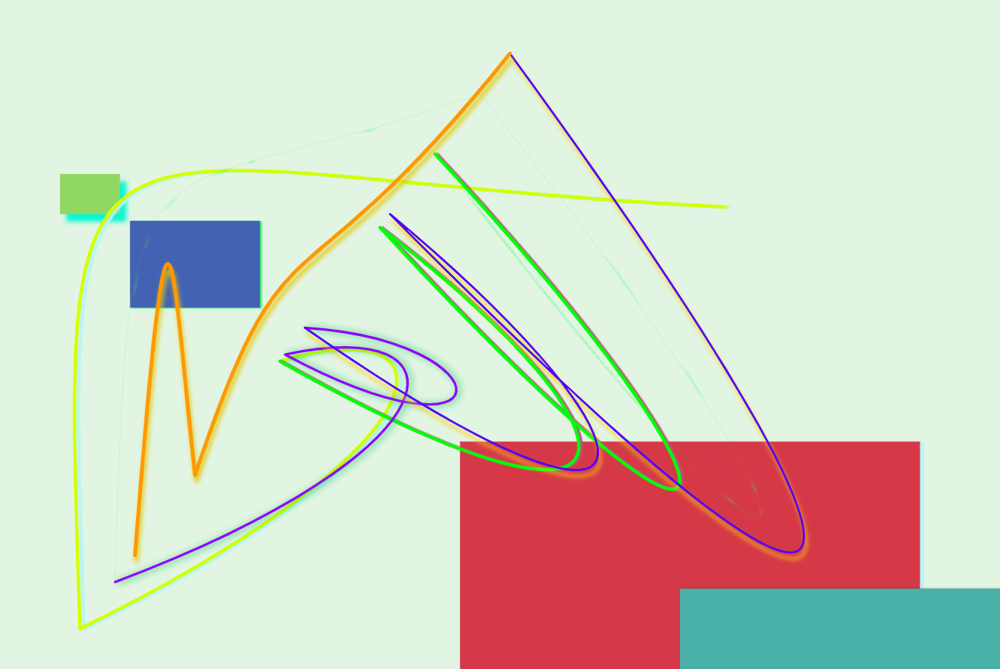

# canvas-art-generator
Vue app that draws randomly-generated Bezier curves and rectangles onto an HTML5 canvas element. Drawings can be downloaded and saved as .png files.

https://canvas-art-generator.netlify.app



## Project setup
```
npm install
```

### Compiles and hot-reloads for development
```
npm run serve
```

### Compiles and minifies for production
```
npm run build
```

### Run your tests
```
npm run test
```

### Lints and fixes files
```
npm run lint
```

### Customize configuration
See [Configuration Reference](https://cli.vuejs.org/config/).
